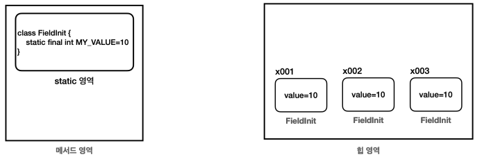

`final`키워드는 이름 그대로 끝! 이라는 뜻이다. 변수에 `final`키워드가 붙으면 더는 값을 변경할 수 없다.

- `final`을 지역 변수에 설정할 경우 최초 한번만 할당할 수 있다. 이후에 변수의 값을 변경하려면 컴파일 오류가 발생한다.
- `final`을 지역 변수 선언시 바로 초기화 한 경우 이미 값이 할당되었기 때문에 값을 할당할 수 없다.
- 매개변수에 `final`이 붙으면 매서드 내부에서 매개변수의 값을 변경할 수 없다. 매서드 호출 시점에 사용된 값이 끝까지 사용된다.
