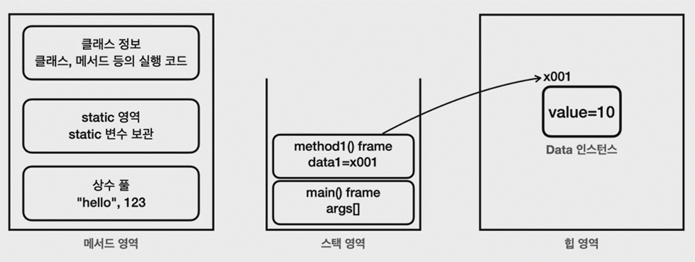
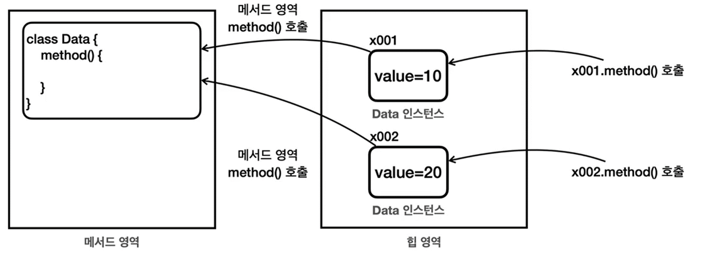
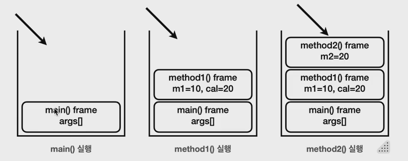
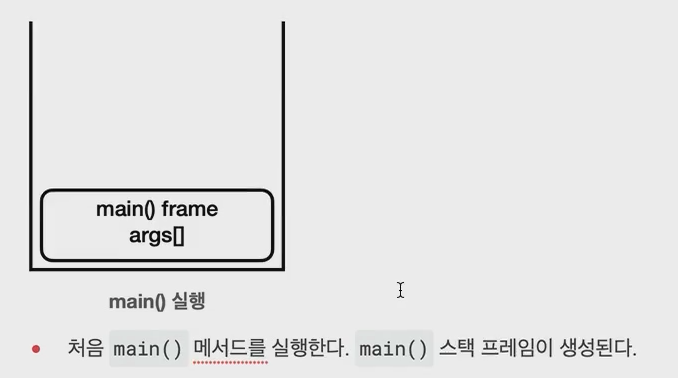
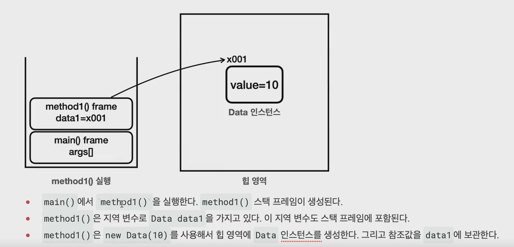
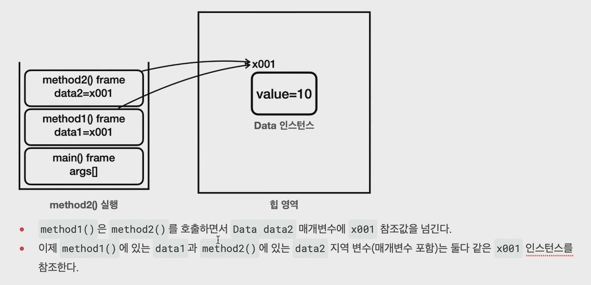
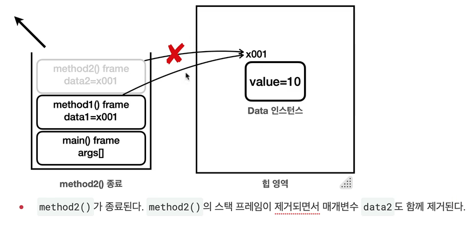
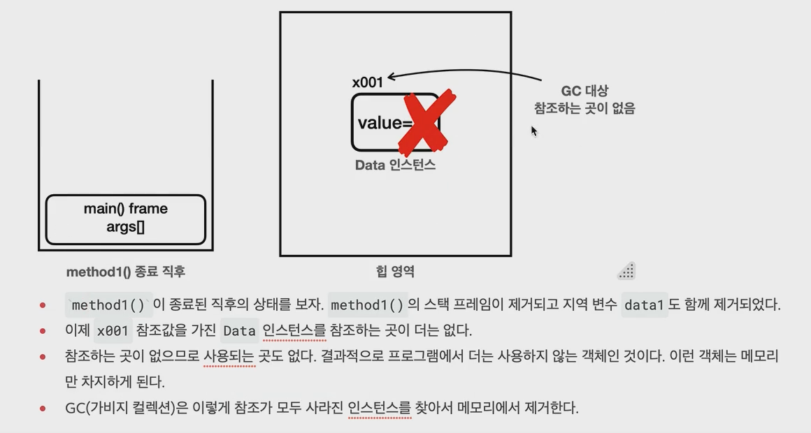

# 자바 메모리 구조
## 예시

자바의 메모리 구조는 크게 메서드 영역, 스택 영역, 힙 영역 3개로 나눌 수 있다.
- 메서드 영역 : 클래스 정보를 보관한다. 이 클래스 정보가 붕어빵 틀이다.
- 스택 영역 : 실제 프로그램이 실행되는 뎡역이다. 메서드를 실행할 때 마다 하나씩 쌓인다.
- 힙 영역 : 객체(인스턴스)가 생성되는 영역이다.(`ex) new Data`) `new` 명령어를 사용하면 이 영역을 사용한다. 쉽게 이야기해서 붕어빠 틀로부터 생성된 붕어빵이 존재하는 공간이다. 참고로 배열도 이 영역에 생성된다.

## 실제

- 메서드 영역 : 메서드 영역은 프로그램을 실행하는데 필요한 공통 데이터를 관리한다. 이 영역은 프로그램의 모든 영역에서 공유한다.
  - 클래스 정보 : 클래스의 실행 코드(바이트 코드), 필드, 메서드와 생성자 코드 등 모든 실행 코드가 존재한다.
  - static 영역 : `static` 변수들을 보관한다.
  - 런타임 상수 풀(최적화 영역) : 프로그램을 실행하는데 필요한 공통 리터럴 상수를 보관하다. 예를 들어서 프로그램이 `"hello"`라는 리터럴 문자가 있으면 이런 문자를 공통으로 묶어서 관리한다. 이 외에도 프로그램을 효율적으로 관리하기 위한 상수들을 관리한다.
- 스택 영역 : 자바 실행 시, 하나의 실행 스택이 생성된다. 각 스택 프레임은 `지역 변수`, `중간 연산 결과`, `메서드 호출 정보` 등을 포함한다.
  - 스택 프레임: 스택 영역에 쌓이는 네모 박스가 하나의 스택 프레임이다. 메서드를 호출할 때 마다 하나의 스택 프레임이 쌓이고, 메서드가 종료되면 해당 스택 프레임이 제거된다.
- 힙 영역 : 객체(인스턴스)와 배열이 생성되는 영역이다. 가비지 컬렉션(GC)이 이루어지는 주요 영역이며, 더 이상 참조되지 않는 객체는 GC에 의해 제거된다.

# 메서드 코드는 메서드 영역에

자바에서 특정 클래스로 100개의 인스턴스를 생성하면, 힙 메모리에 100개의 인스턴스가 생긴다. 각각의 인스턴스는 내부에 변수와 메서드를 가진다.
같은 클래스로 부터 생성된 객체라도, 인스턴스 내부에 변수의 값은 서로 다를 수 있지만, 메서드는 공통된 코드를 공유한다.
따라서 객체가 생성될 떄, 인스턴스 변수에는 메모리가 할당되지만, 메서드에 대한 새로운 메모리 할당은 없다.
메서드는 메서드 영역에서 공통을 관리되고 실행된다.
정리하면 인스턴스의 메서드를 호출하면 실제로는 메서드 영역에 있는 코드를 불러서 수행한다.

# 스택과 큐 자료 구조
자바 메모리구조 중 스택 영역에 대해 알아보기 전에 먼저 스택(Stack)이라는 자료 구조에 대해서 알아본다.

- 처음 자바 프로그램을 실행하면 `main()`을 실행한다. 이때 `main()`을 위한 스택 프레임이 하나 생성된다.
  - `main()`스택 프레임은 내부에 `args`라는 매개변수를 가진다.
- `main()`은 `method1()`을 호출한다. `method1()` 스택 프레임이 생성된ㄷ.
  - `method1()`은 `m1`, `cal`지역 변수(매개변수 포함)를 가지므로 해당 지역 변수들이 스택 프레임에 포함된다.
- `method1()`은 `method2()`를 호출한다. `method2()`스택 프레임이 생성된다. `method2()`는 `m2`진역변수(매개변수 포함)를 가지므로 해당 지역 변수가 스택 프레임에 포함된다.

## 정리
- 자바는 스택 영역을 사용해서 메서드 호출과 지역 변수(매개변수 포함)를 관리한다.
- 메서드를 계속 호출하면 스택 프렝미이 계속 쌓인다.
- 지역 변수(매개변수 포함)는 스택 영역에서 관리한다.
- 스택 프레임이 종료되면 지역 변수도 함께 제거된다.
- 스택 프레임이 모두 제거되면 프로그램도 종료된다.

# 스택 영역과 힙 영역

참고 : 힙 영역 외부가 아닌, 힙 여역 안에서만 인스턴스끼리 서로 참조하는 경우에도 GC의 대상이 된다.
